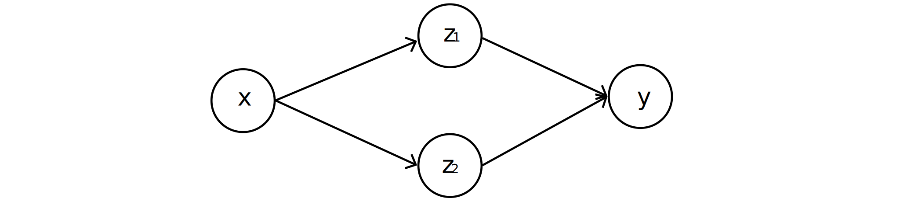
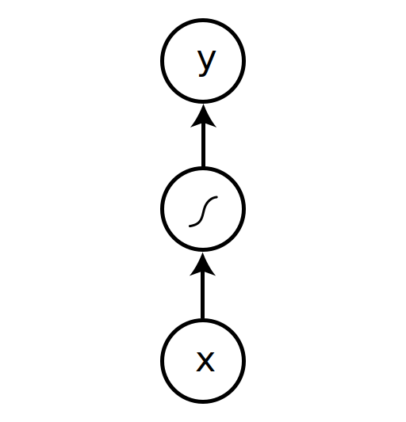
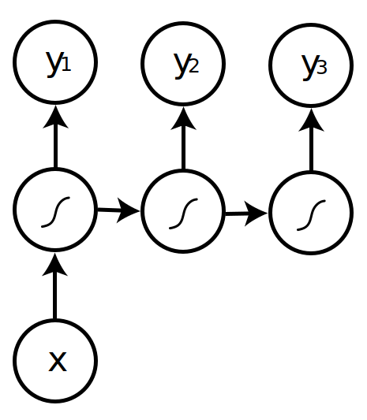
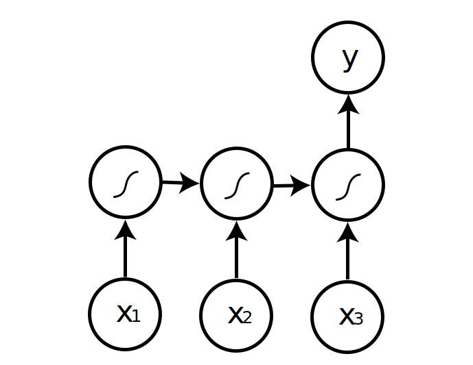
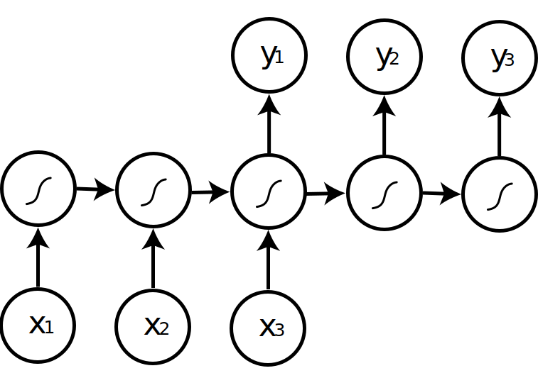
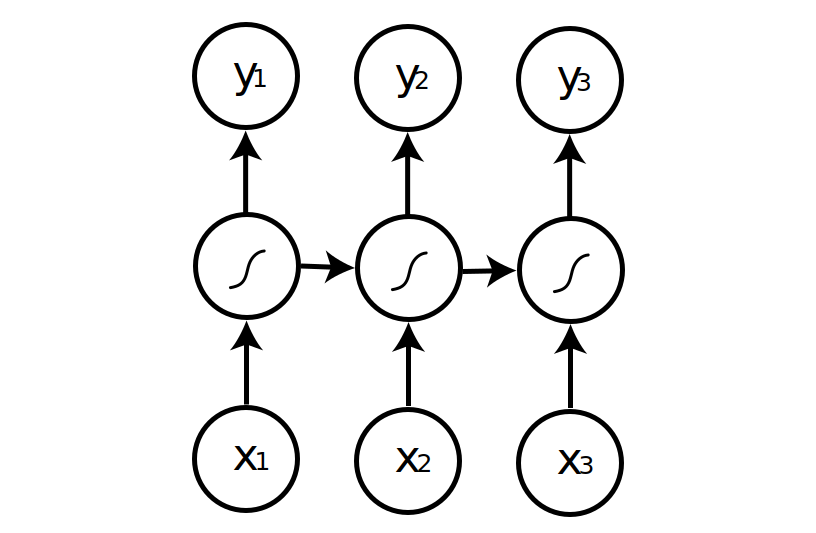

# 10-701 Intro to Machine Learning

###  Math / Probability / ML concepts

- Matrix calculus:

$$
\begin{aligned}\mathbf{x}=\begin{bmatrix}x_1\\ x_2\\ \vdots\\ x_n\end{bmatrix}
\qquad \frac{\partial f}{\partial\mathbf{x}}=\begin{bmatrix}\frac{\partial f}{\partial x_1}\\ \frac{\partial f}{\partial x_2}\\ \vdots\\ \frac{\partial f}{\partial x_n}\end{bmatrix}\end{aligned}
$$

- Lagrange multiplier: 

  
  $$
  \begin{aligned}
  &\text{maximize}\quad f(x_1,\dots,x_n)\\
  &\text{subject to}\quad g(x_1,\dots,x_n)=0
  \end{aligned}
  $$
  

  Construct the Lagrangian:

$$
\mathcal{L}(x_1,\dots,x_n,\lambda)=f(x_1,\dots,x_n)-\lambda g(x_1,\dots,x_n)\Rightarrow \nabla_{x_1,\dots,x_n}f=\lambda\nabla_{x_1,\dots,x_n}g
$$

- Jensen's inequality: $\varphi$ is a convex function,

$$
\varphi(\mathbb{E}[X])\le \mathbb{E}[\varphi(x)]
$$

- **Minkowski metric**:

  
  $$
  d(x,y)=\left(\sum_i|x_i-y_i|^r\right)^\frac1r
  $$
  

  **Manhattan distance**: $\textbf{p},\textbf{q}$ are vectors,

  
  $$
  d_1(\textbf{p},\textbf{q})=\sum_i|p_i-q_i|
  $$
  

  Manhattan distance is called **Hamming distance** when all features are binary

- **Pearson correlation coefficient**: $X,Y$ are RVs,

$$
\rho_{X,Y}=\frac{\text{cov}(X,Y)}{\sigma_X\sigma_Y}
$$

$$
\underbrace{p(\boldsymbol{\theta}\mid\mathcal{D})}_{\textbf{posterior}}\propto \underbrace{p(\mathcal{D}\mid\boldsymbol{\theta})}_{\textbf{likelihood}}\underbrace{p(\boldsymbol{\theta})}_{\textbf{prior}}
$$

- Chain rule: $\mathbb{P}(A,B)=\mathbb{P}(A\mid B)\mathbb{P}(B)$

- Bayes rule: $\mathbb{P}(A\mid B)=\frac{\mathbb{P}(B\mid A)\mathbb{P}(A)}{\mathbb{P}(B)}=\frac{\mathbb{P}(B\mid A)\mathbb{P}(A)}{\sum_A\mathbb{P}(B\mid A)\mathbb{P}(A)}$

- Gaussian distribution:

  
  $$
  \mathbb{P}(x\mid\Theta)=\frac{1}{\sqrt{2\pi\sigma^2}}e^{-\frac{(x-\mu)^2}{2\sigma^2}}
  $$
  

  Beta distribution: (equivalent to pseudo-counts)

$$
\mathbb{P}(x)=\frac{x^{\alpha-1}(1-x)^{\beta-1}}{B(\alpha,\beta)}\text{ where }B(\alpha,\beta)=\frac{\Gamma(\alpha)\Gamma(\beta)}{\Gamma(\alpha+\beta)}
$$

- Covariance$(X_1,X_2)=\mathbb{E}[(X_1-\mathbb{E}[X_1])(X_2-\mathbb{E}[X_2])]$
- Union bound: $\mathbb{P}(A_1\cup A_2\cup\dots\cup A_k)\le\sum_{i=1}^k\mathbb{P}(A_i)$
- **Hoeffding inequality**: Let $Z_1,\dots,Z_m$ be $m$ i.i.d. RV drawn from a Bernoulli($\phi$) distribution, let $\hat{\phi}=\frac1m\sum_{i=1}^mZ_i$ be the mean of these RVs. Fix $\gamma>0$, then

$$
\mathbb{P}(\|\phi-\hat{\phi}\|>\gamma)\le 2e^{-2\gamma^2m}
$$

- 

$$
\fbox{Data}\overset{\text{learning}}{\xrightarrow{}}\fbox{Model}\overset{\text{inference}}{\xrightarrow{}}\fbox{Knowledge}
$$

- **Parametric** models: fixed # parameters, more data $\Rightarrow$ better fit (need few data, fast, stronger distributional assumptions): Linear/Logistic Regression, Naïve Bayes, Discriminant Analysis, Neural Networks

  **Non-parametric** models: # parameters grows with the data, more data $\Rightarrow$ more complex model (more flexible, computationally intractable for large datasets): KNN, Decision Tree

- **Discriminative** models: $p(Y\mid X)$, find the decision boundary directly

  **Generative** models: $p(X\mid Y)$ (generating data), model distributions and choose the one with the highest probability

- **Predictive / supervised learning**: given $\mathcal{D}=\\{(\textbf{x}_i,y_i)\\}\_{i=1}^N$, learn $F:\textbf{x}_k\to y$

  **Descriptive / unsupervised learning**: given $\mathcal{D}=\\{\textbf{x}_i\\}\_{i=1}^N$, group the data into $Y$ classes using a model $F:\mathbf{x}_k\to y_j\Rightarrow$ knowledge discovery

---

### MLE / Density estimation

$$
\begin{align*}
L(\boldsymbol{\theta})&=p(\mathcal{D}|\boldsymbol{\theta})=\prod_{i=1}^Np(x_i|\boldsymbol{\theta})\\
\ell(\boldsymbol{\theta})&=\sum_{i=1}^N\log p(x_i |\boldsymbol{\theta})\\
\hat{\boldsymbol{\theta}}^{MLE}&=\arg\max_{\boldsymbol{\theta}}p(\mathcal{D}|\boldsymbol{\theta})=\arg\max_{\boldsymbol{\theta}}\log p(\mathcal{D}|\boldsymbol{\theta})
\end{align*}
$$

### MAP

$$
\begin{align*}
L(\boldsymbol{\theta})&=p(\boldsymbol{\theta})\prod_{i=1}^Np(x_i|\boldsymbol{\theta})\\
\hat{\boldsymbol{\theta}}^{MAP}&=\arg\max_{\boldsymbol{\theta}} p(\mathcal{D}|\boldsymbol{\theta})p(\boldsymbol{\theta})=\arg\max_{\boldsymbol{\theta}}[\log p(\mathcal{D}|\boldsymbol{\theta})+\log p(\boldsymbol{\theta})]
\end{align*}
$$

|                                                     |                             MLE                              |                             MAP                              |
| :-------------------------------------------------: | :----------------------------------------------------------: | :----------------------------------------------------------: |
|  Discriminative <br />(more data; less assumption)  | $p(\mathcal{D}\mid\boldsymbol{\theta})$ <br /> $p(y\mid\textbf{X},\boldsymbol{\theta})$ <br />$\text{linear/logistic regression with polynomial features}$ | $p(\mathcal{D}\mid\boldsymbol{\theta})p(\boldsymbol{\theta})$ <br />$p(y\mid\textbf{X},\boldsymbol{\theta})p(\boldsymbol{\theta})$ <br />$\text{linear regression with $\ell_2$ regularization}$<br />$\text{logistic regression with Laplace prior}$ |
| Generative <br />(less data; more model assumption) | $p(\mathcal{D}\mid\boldsymbol{\theta})$ <br />$p(\textbf{X}\mid y,\boldsymbol{\theta})p(y\mid\boldsymbol{\theta})$<br />$\text{naïve Bayes}$ | $p(\mathcal{D}\mid\boldsymbol{\theta})p(\boldsymbol{\theta})$<br />$p(\textbf{X}\mid y,\boldsymbol{\theta})p(y\mid\boldsymbol{\theta})p(\boldsymbol{\theta})$<br />$\text{naïve Bayes with Laplace smoothing}$ |

---

### KNN

- Select the class based on the majority vote in the $k$ closest points

$$
p(y=c|\textbf{x},\mathcal{D},K)=\frac{1}{K}\sum_{i\in N_K(x,\mathcal{D})}\mathbb{I}(y_i=c)
$$

- Bias vs. Variance tradeoff:
  - larger $K\rightarrow$ more stable predicted label
  - smaller $K\rightarrow$ predicted label more affected by training points (overfitting?)
- Assumptions:
  - similar points have similar neighbors
  - all feature dimensions are created equally: use neural networks to learn to transform input data into a feature space where distance is more meaningful

---

### Linear regression

$$
\hat{y}=\textbf{X}\textbf{w}+\epsilon
$$

- To minimize the least square error:

  
  $$
  \epsilon^2=\sum_i(y_i-\text{w}x_i)^2\Rightarrow\frac{\partial\epsilon^2}{\partial\text{w}}=2\sum_i-x_i(y_i-wx_i)=0\Rightarrow\arg\min_\textbf{w}\epsilon^2=\frac{\sum_ix_iy_i}{\sum_ix_i^2}
  $$

- As long as the coefficients are linear, the equation is still a linear regression problem, e.g. $y=10+3x_1^2-2x_2^2+\epsilon$ 

- Non-linear basis function expansion: $p(y\|\textbf{x},\textbf{$\theta$})=\mathcal{N}(y\|\textbf{w}^T\boldsymbol{\phi}(\textbf{x}),\sigma^2)$ where

  - Polynomial: $\phi_j(x)=x^j$ for $j=0,\dots,n$
  - Gaussian: $\phi_j(x)=\frac{(x-\mu_j)}{2\sigma_j^2}$
  - Sigmoid: $\phi_j(x)=\frac{1}{1+\exp(-s_jx)}$

- General linear regression:

  

$$
J(\mathbf{w})=\sum_i(y^i-\mathbf{w}^T\phi(\mathbf{x}^i))^2
$$

$$
\mathbf{w}=(\Phi^T\Phi)^{-1}\Phi^Ty
$$

- Extension to linear regression that adjusts parameters based on inputs:

  - **Splines**: fit a set of piecewise (usually cubic) polynomials satisfying continuity and smoothness constraints

    Need to define the regions of input in advance (usually uniform)

  - **Local kernel regression, spatially adaptive regression** etc.

---

### Logistic regression

- **Sigmoid** function: 

$$
\sigma(a)=\frac{1}{1+\exp(-a)},\frac{d\sigma}{da}=\sigma(1-\sigma)
$$

- Binary classification model:

$$
p(y=0\mid\textbf{X},\textbf{w})=\sigma(\textbf{w}^T\textbf{X})=\frac{1}{1+e^{\textbf{w}^T\textbf{X}}}\\
p(y=1\mid\textbf{X},\textbf{w})=1-\sigma(\textbf{w}^T\textbf{X})=\frac{e^{\textbf{w}^T\textbf{X}}}{1+e^{\textbf{w}^T\textbf{X}}}
$$

- Likelihood and log-likelihood of the data given the model: (No closed-form solution)

$$
L(y\mid \text{X},\text{w})=\prod_i\sigma(\text{w}^Tx_i)^{1-y_i}\left(1-\sigma(\text{w}^Tx_i)\right)^{y_i}
$$

$$
\ell(y\mid \text{X},\text{w})=\sum_i(1-y_i)\log\sigma(\text{w}^Tx_i)+y_i\log\left(1-\sigma(\text{w}^Tx_i)\right)
$$

- **Gradient descent** for logistic regression (positive definite Hessian $\Rightarrow$ strictly convex, unique global minimum):

$$
\frac{\partial\ell}{\partial\textbf{w}_j}=\sum_ix_{i,j}[y_i-(1-\sigma(\text{w}^Tx_i))]
$$

$$
\boldsymbol{w}_j^{k+1}\leftarrow\boldsymbol{w}_j^k-\underbrace{\eta_k}_{\textbf{learning rate}}\frac{\partial\ell}{\partial\textbf{w}}
$$

- Logistic regression for more than 2 classes:

$$
p(y_i=j\mid\textbf{X},\theta)=\frac{\exp\left(\textbf{w}_j^Tx_i\right)}{1+\sum_{c=1}^{k-1}\exp\left(\textbf{w}_c^Tx_i\right)}
$$

$$
p(y=k\mid\textbf{X},\theta)=\frac{1}{1+\sum_{c=1}^{k-1}\exp\left(\textbf{w}_c^Tx_i\right)}
$$

- Update rule:

$$
\frac{\partial\ell(\textbf{w})}{\partial\textbf{w}_m^j}=\sum_ix_{i,j}[𝟙_{(y_i=m)}-p(y_i=m\mid x_i,\textbf{w})]
$$

- Decision boundary: close to linear

---

### Decision trees

```
BuildTree(n, A):
	if empty(A) or lable(n) are the same:
		status = leaf
		class = most common class of label(n)
	else:
		status = internal
		a = BestAttribute(n, A)
		LeftNode = BuildTree(n(a=1), A \ {a})
		RightNode = BuildTree(n(a=0), A \ {a})
```

- **Entropy** quantifies the amount of uncertainty associated with a specific probability distribution

  Higher entropy $\Rightarrow$ less confidence in the outcome

  
  $$
  H(X)=\sum_i-p(X=i)\log_2p(X=i)
  $$
  

  **Specific conditional entropy**:

  
  $$
  H(Y|X=x)=-\sum_{y\in\mathcal{Y}}p(Y=y|X=x)\log_2p(Y=y|X=x)
  $$
  

  **Conditional entropy**:

  
  $$
  H(Y|X)=\sum_{x\in\mathcal{X}}p(X=x)H(Y|X=x)
  $$
  

  **Mutual information** is a measure of reduced uncertainty about $Y$ by the knowledge of $X$:

  
  $$
  I(Y;X)=H(Y)-H(Y|X)=H(X)-H(X|Y)
  $$
  

  The best attribute maximizes information gain

- Do not assume independence of the input features

- Overfitting:

  - Pre-pruning: Fixed depth/number of leaves
  - Post-pruning: check test data error

  Continuous feature: **dyadic decision trees** (split on mid points of features)

- Decision tree follows a greedy procedure (every `BestAttribute` is a local optimal): 3-way split is better than two binary splits

---

### Naïve Bayes

- Assume the features $x_i$ are **conditionally independent** given the class label $y$,

  
  $$
  p(X_i|y_i=1,\Theta)=\prod_jp(x_i^j|y_i=1,\theta^j_1)
  $$
  

  $X_i$: vector of binary attributes for sample $i$

  $\Theta$: the set of all parameters in the NB model

  $\theta^j_1$: the specific parameter for attribute $j$ in class $1$

- Learning:

  
  $$
  p(x^j=1|y=1)=\frac{n_1}{N}
  $$
  

- Classification:

$$
\hat{y}=\arg\max_vp(y=v|X)=\arg\max_v\prod_jp(x^j|y=v)p(y=v)
$$

- **Laplace smoothing** (pseudo count): $\lambda$-smoothing to ensure non-zero probabilities for attribute $j$ that has $k$ classes,

$$
\phi_1=\frac{\lambda+\sum_{i=1}^N𝟙_{(x^j_i=1)}}{k\lambda+N}
$$

- Generative models with continuous features: Bernouli class distribution $y\sim\mathrm{Bern}(\phi)$ with Gaussian class-conditional distribution $\textbf{X}\sim\mathcal{N}(\boldsymbol{\mu}_y,\boldsymbol{\Sigma}_y)$

  - MLE for mean and variance:

    
    $$
    \mu_1^j=\sum_{\text{$i$ s.t. $y_i=1$}}\frac{x_i^j}{k_1}\qquad \left(\sigma_1^j\right)^2=\sum_{\text{$i$ s.t. $y_i=1$}}\frac{(x_i^j-\mu_1^j)^2}{k_1}
    $$
    

  - Decision boundary (only vertical/horizontal line because of NB assumption of conditional independence)

    - Naïve Bayes assumption: diagonal $\Sigma_y$
    - Linear decision boundary: $\Sigma_{y=0}=\Sigma_{y=1}$
    - Quadratic decision boundary: $\Sigma_{y=0}\ne\Sigma_{y=1}$

---

### Neural networks

- **Input layer, hidden layer, output layer**

- Activation function: functions $g:\mathbb{R}^d\to\mathbb{R}^d$ that take the results of our linear product $\alpha^i$ and applies some (typically non-linear, since otherwise linear layers can be reduced to an exactly equivalent single linear layer) function elementwise

  - Sigmoid function: $g(\alpha^i)=\frac{1}{1+\exp(-\alpha^i)}$
  - ReLU (rectified linear unit): $g(\alpha^i)=\max\{0,\alpha^i\}$
  - Identity function

- **Backpropogation**:

  

$$
\frac{\partial y}{\partial x}=\frac{\partial y}{\partial z_1}\frac{\partial z_1}{\partial x}+\frac{\partial y}{\partial z_2}\frac{\partial z_2}{\partial x}
$$

- **Pretraining**:

  - A better initialization strategy of weight parameters
  - Useful when training data is limited

- **Universal Approximation Theorem**: any function can be approximated to arbitrary accuracy by a network with two hidden layers

  Every bounded continuous function can be approximated with arbitrary small error by network with one hidden layer

  Every boolean function can be represented by network with signle hidden layer (may require exponential hidden units)

- **Convolutional Neural Network (CNN)**: 

  - Given input volume $W_1,H_1,D_1$, using $K$ units with receptive fields $F\times F$ and applying them at strides of $S$ gives output volume

    

    
    $$
    W_2=(W_1-F)/S+1
    $$

    $$
    H_2=(H_1-F)/S+1
    $$

    $$
    D_2=K
    $$

    

  - Pooling doesn't change depth

  - Hierarchical architecture: more global, invariant, abstract representations as going up layers

  - Filtering+NonLinearity+Pooling = 1 stage of CNN

    - Filtering detects conjunctions of features
    - Pooling computes local disjunctions of features

  - All layers are trainable

  - Training CNN

    - highly nonconvex objective: add momentum, different learning rates, initialization matters
    - avoid overfitting: data augmentation, add regularizations, dropout, early stopping

---

### Deep neural networks

- Building blocks of deep networks: activation functions, layers, loss functions

- **ConvNets**

  - sparse connectivity
  - shared weights
  - increasingly global receptive fields: simple cells detect local features, complex cells pool the outputs of simple cells within a retinotopic neighborhood

- **Recurrent networks (RNNs)**

  |       one to one        |       one to many       |               many to one                |              many to many              |                   many to many                   |
  | :---------------------: | :---------------------: | :--------------------------------------: | :------------------------------------: | :----------------------------------------------: |
  |  |  |                   |                 |                           |
  |  Image classification   |    Image captioning     | Sentiment analysis <br>video recognition | Machine translation <br />(Seq-to-seq) | Named entity recognition<br />(Sequence tagging) |

  - **Vanishing / Exploding gradients** $\Rightarrow$ **gradient clipping**: scale gradient if its norm is too big
  - **Long Short Term Memory (LSTM)** alleviates the long-term dependency problem:
    - **Forget gate** decides what must be removed from $h_{t-1}$
    - **Input gate** decides what new information to store in the cell
    - **Output gate** decides what to output from cell state
  - **Bi-directional RNN**: hidden state is the concatenation of both forward and backward hidden states $\Rightarrow$ capture both past and future information
  - **Tree-structured RNN**: hidden states condition on both an input vector and the hidden states of arbitrarily many child units
  - RNN for 2D sequences: Pixel CNN, Row LSTM, Diagonal Bi-LSTM

- **Attention**

  - Long-range dependency, attending to smaller parts of data, improved interpretability
  - Weighted by "attention weights"

- **Multi-head (Self-)Attention**

- **BERT**: a model to extract contextualized word embedding

---

### SVM / Kernels

- technique combining the kernel trick plus a modified loss function and producing sparse solution so the prediction only depends on a subset of training data known as **support vectors**

- **Maximum margin classifier** in primal form:

  - $M=\frac{2}{\sqrt{\textbf{w}^T\textbf{w}}}$

  - linear separable case:

    
    $$
    \min\frac{\textbf{w}^T\textbf{w}}{2}
    $$

    $$
    y_i\left(\textbf{w}^Tx_i+b\right)\ge 1,\forall i
    $$

    

  - non-linear separable case:

    
    $$
    \min\frac{\textbf{w}^T\textbf{w}}{2}+C\sum_{i=1}^N\xi_i
    $$

    $$
    \underbrace{\xi_i\ge 0}_\textbf{slack variables}
    $$

    $$
    \underbrace{y_i\left(\textbf{w}^Tx_i+b\right)\ge 1-\xi_i}_\textbf{soft margin constraints},\forall i
    $$

    

  where $C$ is a regularization parameter that controls the number of errors tolerable on the training set (larger $C$ value means smaller errors and harder margin $\Rightarrow C=\infty$ gives the linear separable model)

  Define $C=\frac{1}{(\upsilon N)}$ where $\upsilon\in(0,1]$ controls the fraction of misclassified points allowed during in training $\Rightarrow \upsilon$-SVM classifer

- **Quadratic programming (QP)** solves optimization problems of the form: $R$ - squared matrix, $d$ - vector, $c$ - scalar

  
  $$
  \min_u\frac{u^TRu}{2}+d^Tu+c
  $$

  $$
  \text{subject to $n$ inequality constraints}\quad \sum_ja_{ij}u_j\le b_i,\forall i\in[n]
  $$

  $$
  \text{and $k$ equivalency constraints}\quad \sum_ja_{(n+i)j}u_j=b_{n+i},\forall i\in[k]
  $$

  

- Dual form:

  - linear separable case:

    
    $$
    \max_\alpha\sum_i\alpha_i-\frac12\sum_{i,j}\alpha_i\alpha_jy_iy_jx_i^Tx_j
    $$

    $$
    \sum_i\alpha_iy_i=0
    $$

    $$
    \alpha_i\ge 0,\forall i
    $$

    

  - non-linear separable case:

    
    $$
    \max_\alpha\sum_i\alpha_i-\frac12\sum_{i,j}\alpha_i\alpha_jy_iy_jx_i^Tx_j
    $$

    $$
    \sum_i\alpha_iy_i=0
    $$

    $$
    C>\alpha_i\ge 0,\forall i
    $$

    

    To evaluate a new sample $x_j$, we need to compute $\textbf{w}^Tx_j+b=\sum_i\alpha_iy_ix_i^Tx_j+b$ 

  - Advantage of dual:

    - reduce the number of parameters (only need to store information of the support vectors)

    - kernel trick:

      
      $$
      \max_\alpha\sum_i\alpha_i-\frac12\sum_{i,j}\alpha_i\alpha_jy_iy_j\Phi(x_i)\Phi(x_j)
      $$

      $$
      \sum_i\alpha_iy_i=0
      $$

      $$
      \alpha_i\ge 0,\forall i
      $$

      

      Any decision boundary that we get from a generative model with class-conditional Gaussian distributions could in principle be reproduced with an SVM and a polynomial kernel

- Non-linear SVMs: $N$ data points are in general separable in a space of $N-1$ dimensions or more

- VC dimension for linear SVMs in $d$-dimensional space is $d+1$

- SVMs work (with huge features spaces and kernels) because

  - \# parameters remains the same and most are set to 0
  - we only care about the support vectors which form a small group of samples
  - the minimization / maximization of margin acts as regularization term

- Multi-class classification with SVM: **one-versus-all**: learn one binary classifier for each class and perform majority vote

---

### Boosting / Ensemble classifiers

- **Voting** (ensemble methods)

  - learn many weak classifiers that are good at different parts of the input space
  - output weighted vote of each classifier

- **Bagging (bootstrap aggregating)**

  - train many trees on bootstrapped data, take average
  - bias remains similar, variance is reduced

- **Random forest**

  - reduce correlation between trees by randomness

    ```
    for b = 1,...,B:
    	Draw a bootstrap dataset Z*
    	Learn a tree f_b on Z*, select m features as candidates before splitting
    ```

    Typically $m\le\sqrt{p}$ 

- **Boosting**

  - given a weak learner, run it multiple times on reweighted training data, then let learned classifiers vote

  - **AdaBoost**

    - Input: $N$ examples $\{(x_1,y_1),\dots,(x_N,y_N)\}$, a weak base learner $h=h(x,\theta)$ 

    - Initialize: equal example weights $w_i=\frac1N,\forall i\in[N]$ 

    - Iterate for $k=1,\dots,m$: 

      - train base learner according to weighted examples set and obtain classifier $h(x,\theta_k)$

      - compute hypothesis error

        
        $$
        \epsilon_k=\frac{\sum_{i=1}^nW_i^{k-1}𝟙_{(y_i\ne h(x_i,\theta_k))}}{\sum_{i=1}^nW_i^{k-1}}
        $$
        

      - compute hypothesis weight

        
        $$
        \alpha_k=\frac12\log\left(\frac{1-\epsilon_k}{\epsilon_k}\right)
        $$
        

      - Update the weigths on the training examples

        
        $$
        W_i^k=W_i^{k-1}\exp(-y_ia_kh(x_i,\theta_k))
        $$

    - Output: the final classifier after $m$ boosting iterations is given by

      
      $$
      \hat{h}(\textbf{x})=\text{sign}\left(\frac{\sum_{i=1}^m\alpha_ih(\textbf{x},\theta_i)}{\sum_{i=1}^m\alpha_i}\right)
      $$

  - Base learners: decision stumps (axis parallel splits), decision trees, multi-layer neural networks, radial basis function networks

  - | \# boosting rounds | bias  | variance |
    | :----------------: | :---: | :------: |
    |   small (simple)   | large |  small   |
    |  large (complex)   | small |  large   |

---

### Hierarchical clustering

- **Hierarchical clustering** where clusters can be nested inside each other:

  - **Bottom-up / agglomerative clustering**

    ```
    Starts with each object in a separate cluster
    Repeatedly joins the most similar pair of clusters
    Update the similarity of the new cluster to others until there is only one cluster
    ```

  - **Top-down / divisive clustering**

    ```
    Starts with all the data in a single cluster
    Consider every possible way to divide the cluster into two, choose the best division
    Recursively operate on both sides
    ```

  - Distance between two clusters can be defined as the distance between

    - **single-link**: nearest neighbor - similarity between their closest members
    - **complete-link**: furthest neighbors - similarity between their furthest members
    - **centroid**: similarity between the centers of gravity
    - **average-link**: average similarity of all cross cluster pairs

- Good clustering

  - Internal criteria
    - Intra-class similarity is high
    - Inter-class similarity is low
    - The measured quality of a clustering depends on the *object representation* and the *similarity measure*
  - External criteria
    - Ability to discover hidden patterns or latent classes in gold standard data
    - With respect to ground truth: **purity** (the ratio between the dominant class in the cluster and the size of cluster) and entropy of classes in clusters

---

### K-means and GMM

- **Partition algorithms** construct a partition of $N$ objects into a set of $K$ clusters

  - Hard assignment: $K$**-means** algorithm (heuristic method)

    - Algorithm:

      ```
      Decide on a value for K
      Initialize K (random) cluster centers
      Iterate:
      	Assign points to the nearest cluster centers based on some metric
      	Re-estimate the K cluster centers (centroid or mean)
      	If none of the objects change membership, exit
      ```

    - Convergence is guaranteed since reassignment monotonically decreases sum of squared distances from cluster centroid as each vector is assigned to the closest centroid

    - Time complexity: $O(lKnm)$ where $m$ is the dimensionality of vectors and assume stop after $l$ iterations
    - Problems:
      - Seed choice: poor convergence or sub-optimal clustering $\Rightarrow$ select good seeds using heuristic; try out multiple starting points; initialize with the results of another method
      - Assumes isotropic, equal variance, convex clusters
      - Sensitive to outliers $\rightarrow K$-medoids (more work)

  - Soft assignment: mixture modeling (generative approach: probability that an object belongs to a cluster) - **Gaussian Mixture Model (GMM)** 

    - **Mixture of Gaussians**:

      
      $$
      p(\textbf{x})=\sum_{k=1}^K\pi_k\mathcal{N}(\textbf{x}|\boldsymbol{\mu}_k\boldsymbol{\Sigma}_k)
      $$
      

      Each Gaussian density $\mathcal{N}(\textbf{x}\|\boldsymbol{\mu}\_k,\boldsymbol{\Sigma}\_k)$ is called a **component** of the mixture and the parameter $\pi_k$ is the **mixing coefficient** such that $\forall i, \pi_k\in[0,1],\sum_{k=1}^k\pi_k=1$ 

    - Assuming $p(\textbf{x}\|y=i)\sim\mathcal{N}(\boldsymbol{\mu}_i,\boldsymbol{\Sigma}_i)$,

      
      $$
      \begin{aligned}
                      p(\textbf{x})&=\sum_{i=1}^Kp(\textbf{x}|y=1)p(y=i)=\sum_{i=1}^K\pi_k\mathcal{N}(\textbf{x}|\boldsymbol{\mu}_i,\boldsymbol{\Sigma}_i)\\
                      p(\textbf{X})&=\prod_{j}\sum_ip(\textbf{x}_j|y=i)p(y=i)=\prod_j\sum_i\frac{1}{\sqrt{\boldsymbol{\Sigma}_i}}\exp\left(-\frac{1}{2}(\textbf{x}_j-\boldsymbol{\mu}_i)^T\boldsymbol{\Sigma}_i(\textbf{x}_j-\boldsymbol{\mu}_i)\right)p(y=i)
      \end{aligned}
      $$

    - **Expectation-maximization (EM) algorithm**: optimization strategy for likelihood objective functions in the presence of missing data (given a Gaussian mixture model, the goal is to maximize the likelihood function with respect to the parameters $\boldsymbol{\theta}=\\{\pi_i,\boldsymbol{\mu}_i,\boldsymbol{\Sigma}\_i\\}\_{i=1}^K$)

      - Complete log likelihood:

        
        $$
        \ell(\boldsymbol{\theta},\textbf{x})=\log\prod_ip(z_i,x_i)\log\prod_ip(z_i\mid\boldsymbol{\theta})p(x_i\mid z_i,\boldsymbol{\theta})
        $$
        

        Expected complete log likelihood:

        
        $$
        \langle\ell(\boldsymbol{\theta},\textbf{x})\rangle=\sum_ip(z\mid x)\log p(z_i\mid\pi)+\sum_ip(z\mid x)\log p(x_i\mid z_i,\boldsymbol{\theta})
        $$
        

        **Free energy**:

        
        $$
        F(\boldsymbol{\theta}\mid\boldsymbol{\theta}^t)=\sum_ip(z_i\mid x_i)\log\frac{p(x_i,z_i\mid\boldsymbol{\theta})}{p(z_i\mid x_i)}\le\ell(\boldsymbol{\theta},\textbf{x})
        $$

      - E step: fill-in hidden values using inference $p(z\mid x,\boldsymbol{\theta}^T)$ 

        
        $$
        Q(\boldsymbol{\theta}\mid\boldsymbol{\theta}^t)=\mathbb{E}_{Z\mid X,\boldsymbol{\theta}^t}[\ell(\boldsymbol{\theta},X,Z]=\sum_ip(z_i\mid x_i)\log p(x_i,z_i\mid\boldsymbol{\theta})
        $$
        

        (for a fixed set of Gaussian mixture model parameters, $\boldsymbol{\theta}^t$, update the probability that each point, $\textbf{x}_i$, belongs to cluster $k$)

        
        $$
        p(y=k|\textbf{x}_i,\boldsymbol{\theta}^t)=\frac{p(\textbf{x}_i|y=k,\boldsymbol{\mu}_i^{(t)},\boldsymbol{\Sigma}_i^{(t)})p(y=k)}{\sum_{j=1}^Kp(\textbf{x}_i|y=j,\boldsymbol{\mu}_j^{(t)},\boldsymbol{\Sigma}_j^{(t)})p(y=j)}=\frac{\pi_k^{(t)}\mathcal{N}\left(\textbf{x}_i;\boldsymbol{\mu}_k^{(t)},\boldsymbol{\Sigma}_k^{(t)}\right)}{\sum_{j=1}^K\pi_j^{(t)}\mathcal{N}\left(\textbf{x}_i;\boldsymbol{\mu}_j^{(t)},\boldsymbol{\Sigma}_j^{(t)}\right)},\forall i,k
        $$

      - M step: update parameters using standard MLE/MAP applied to complete data 

        
        $$
        \boldsymbol{\theta}^{t+1}=\arg\max_\boldsymbol{\theta}Q(\boldsymbol{\theta}\mid\boldsymbol{\theta}^t)
        $$
        

        (re-estimate the parameters $\boldsymbol{\theta}^{(t+1)}$ using the current probabilities)

        
        $$
        \begin{aligned}
        \boldsymbol{\mu}_k^{(t+1)}&=\frac{\sum_{i=1}^Np\left(y=k|\textbf{x}_i,\boldsymbol{\theta}^{(t)}\textbf{x}_i\right)}{\sum_{i=1}^Np\left(y=k|\textbf{x}_i,\boldsymbol{\theta}^{(t)}\right)},\forall k\\
                            \boldsymbol{\Sigma}_k^{(t+1)}&=\frac{\sum_{i=1}^Np\left(y=1|\textbf{x}_i,\boldsymbol{\theta}^{(t)}\right)\left(\textbf{x}_i-\boldsymbol{\mu}_i^{(t+1)}\right)\left(\textbf{x}_i-\boldsymbol{\mu}_i^{(t+1)}\right)^T}{\sum_{i=1}^Np\left(y=1|\textbf{x}_i,\boldsymbol{\theta}^{(t)}\right)},\forall k\\
                            \pi_i^{(t+1)}&=\frac{\sum_{i=1}^Np\left(y=k|\textbf{x}_i,\boldsymbol{\theta}^{(t)}\right)}{N},\forall k
        \end{aligned}
        $$

      - Pros:

        - no learning rate parameter
        - automatically enforces parameter constraints
        - fast for low dimensions
        - Improves likelihood for each iteration

        Cons:

        - performs coordinate ascent, can get stuck in local minima
        - can be slower than conjugate gradient (near convergence)
        - expensive inference step
        - MAP method

---

### PCA

- We want to find an orthogonal set of $K$ linear basis vectors $\textbf{v}_j\in\mathbb{R}^M$ and the corresponding scores $\textbf{z}_i\in\mathbb{R}^K$ such that we minimize the **reconstruction error**

  
  $$
  J(\textbf{V},\textbf{Z})=\sum_{i=1}^N||\textbf{x}_i-\textbf{V}\textbf{z}_i||^2_2
  $$
  

  where $\textbf{V}\in\mathbb{R}^{M\times K},\textbf{Z}\in\mathbb{R}^{N\times K}$ and which is equivalent to maximizing the variance of the projected data 

  
  $$
  \sum_{i=1}^N\left(\textbf{z}_i\right)^2
  $$
  

  The optimal solution is obtained by setting $\textbf{V}=\textbf{V}_K$ that contains the $K$ eigenvectors with largest eigenvalues of the empirical covariance matrix $\hat{\boldsymbol{\Sigma}}=\frac{1}{N}\textbf{X}^T\textbf{X}$ assuming *the data are centered* (with zero mean; if not, subtract off the sample mean). The optimal low-dimensional encoding of the data is given by $\hat{\textbf{z}}_i=\textbf{V}^T\textbf{x}_i$, which is an orthogonal projection of the data onto the column space spanned by the eigenvectors.

  Any vector $\textbf{v}$ that maximizes the variance is an eigenvector of $\boldsymbol{\Sigma}$, i.e. $\boldsymbol{\Sigma}\textbf{v}=\lambda\textbf{v}$ where $\lambda$ equals the variance of the projections along $\textbf{v}$ 

- Choose $K$ such that we retain some fraction of the variance:

  
  $$
  \frac{\sum_{i=1}^K\lambda_i}{\sum_{i=1}^d\lambda_i}
  $$

- **Singular value decomposition (SVD)** - no assumption about centered data

  - Any (real) $N\times D$ matrix \textbf{X} can be decomposed into 

    
    $$
    \underbrace{\textbf{X}}_{N\times D}=\underbrace{\textbf{U}}_{N\times N}\underbrace{\textbf{S}}_{N\times D}\underbrace{\textbf{V}^T}_{D\times D}
    $$

    - $\textbf{U}$: columns are orthonormal $\Rightarrow\textbf{U}^T\textbf{U}=\textbf{I}_N$, left singular vectors of $\textbf{X}$ and eigenvectors of $\textbf{XX}^T$ 
    - $\textbf{S}$: diagonal matrix, diagonal entries $\sigma_k\ge 0$ are singular values of $\textbf{X}\Rightarrow$ $\sigma_k^2$ are eigenvalues of both $\textbf{XX}^T$ and $\textbf{X}^T\textbf{X}$ 
    - $\textbf{V}$: rows and columns are orthonormal $\Rightarrow\textbf{V}^T\textbf{V}=\textbf{VV}^T=\textbf{I}_D$, columns are eigenvectors of $\textbf{X}^T\textbf{X}$ 

- PCA algorithm: given input $\textbf{X},\textbf{X}_{test},K$,

  - center data based on training data
  - $\textbf{V}_K=\mathrm{eigenvectors}\left(\textbf{X}^T\textbf{X}\right)_K$ (top $K$ eigenvectors)
  - $\textbf{Z}_{test}=\textbf{V}_K^T\textbf{X}_{test}$ 

  Kernel PCA algorithm: given input $\textbf{X},\textbf{x}_{test},L$,

  - kernel matrix $\textbf{K}_{ij}=k(\textbf{X}_i,\textbf{X}_j)$
  - center $K$
  - $\textbf{U}=\mathrm{eigenvectors}(\textbf{K})_L,\boldsymbol{\lambda}=\mathrm{eigenvalues}(\textbf{K})_L$
  - $\boldsymbol{\alpha}_j=\frac{1}{\sqrt{\lambda_j}}\textbf{U}_j$
  - $z_{test,j}=\sum_{i}\alpha_{ij}k(\textbf{X}_i,\textbf{x}_{test})$ 

---

### Bayesian networks

- **Bayesian networks** are *direcged acyclic graphs* with nodes representing *random variables* and edges representing *dependency assumptions*:

  
  $$
  p(x_1,\dots,x_n)=\prod_ip(x_i|parent(x_i))
  $$

- **Markov blanket**: all parent, children and co-parents of children

  <center></center>

  In a Bayesian network, a variable is conditionally independent of all other variables given its Markov blanket

- Two variables $x,y$ are **$d$-separated** given a set of variable s $Z$, $I(x,y)\mid Z$, if $x,y$ are conditionally independent given $Z$

  - $Z=\varnothing$, all paths are blocked by a collider
  - $Z$ doesn't contain colliders or their descendants, all paths are blocked by some member of $Z$
  - Colliders in $Z$ or having descendants in $Z$ don't block the path

- Inference: general querying of Bayesian networks is $\mathsf{NP}$-complete

  
  $$
  p(A\mid B,C)=\frac{p(A,B,C)}{p(A,B,C)+p(\neg A,B,C)}
  $$

  - **Stochastic inference**: sample the free variables then for every other variable, if all parents have been sampled, sample based on conditional distribution

    Problem: if the condition rarely happens, lots of samples would be wasted

  - **Weighted sampling**: sample the joint setting and set values for observed variables, compute the weight

  - **Variable elimination**: reuse computations by storing as a function 

    Problem: efficiency depends on the network structure

  - Other methods: convert network to a *polytree* ($\le$1 path between every two nodes)

    Problem: converting into a polytree can result in exponential increase in the size of CPTs

- Bayesian networks are useful in modeling joint distributions

  Limitations:

  - cannot account for temporal / sequence models
  - DAG (no loops)

---

### HMMs

- **Hidden Markov model**:

  - $\{s_1,\dots,s_n\}$: a set of states; in each time $t$, we are in $q_t=s_i$ 
  - $\pi_i$: the probability that we start at state $s_i$
  - $p(q_t=s_i\mid q_{t-1}=s_j)$: transition probability
  - $\Sigma$: a set of possible outputs; at time $t$ we emit a symbol $\sigma\in\Sigma$
  - $p(O_t=\sigma\mid s_i)$: emission probability

- **Markov property**: current state only depends on previous state 

  
  $$
  p(q_{t+1}=s_i\mid q_t=s_j)=p(q_{t+1}=s_i\mid q_t=s_j,q_{t-1}=s_j)
  $$

- Inference

  - $p(Q)$: if we cannot look at observations, define $p_t(i)=p(q_t=s_i)$

    
    $$
    \begin{aligned}
    &p_1(i)=\pi_i\\
    &p_t(i)=\sum_jp(q_t=s_i\mid q_{t-1}=s_j)p_{t-1}(j)
    \end{aligned}
    $$
    

    **Limit theorem** for Markov transitions: if we don't see any observations and if the transition matrix is strictly positive then there is a fixed probability for being at any state (starting point doesn't matter at the limit)

    
    $$
    \lim_{k\to\infty}(P^k)_{i,j}=\theta_j
    $$

  - $ p(Q\mid O)$: if we have observations, define 

    - $a_{j,i}=p(q_t=s_i\mid q_{t-1}=s_j)$ (transition probability)

    - $b_i(O_t)=p(O_t\mid s_i)$ (emission probability)

    - $\alpha_t(i)=p(O_1,\dots,O_t\wedge q_t=s_i)$ (observe $O_1,\dots,O_t$, end up at state $i$)

      
      $$
      \begin{aligned}
      &\alpha_1(i)=p(O_1\mid q_1=s_i)\pi_i\\
      &\alpha_{t+1}(i)=\sum_jb_i(O_{t+1})a_{j,i}\alpha_t(j)\\
      \Rightarrow&p(q_t=s_i\mid O_1,\dots,O_t)=\frac{\alpha_t(i)}{\sum_j\alpha_t(j)}
      \end{aligned}
      $$

    

    Complexity: $p(Q):O(t),p(O\mid Q):O(t),p(O):O(n^2t)$ 

    
    $$
    p(Q\mid O)=\frac{p(O\mid Q)p(Q)}{p(O)}=\frac{\prod_ip(O_1\mid q_i)\prod_ip(q_{i+1}\mid q_i)p(q_1)}{\sum_i\alpha_t(i)}
    $$

  - $\arg\max_Qp(Q\mid O)$: compute the most probable path, define $\delta_t(i)=\max_{q_1,\dots,q_{t-1}}p(q_1,\dots,q_{t-1}\wedge q_t=s_i\wedge O_1,\dots,O_t)$ (most likely path from $1$ to $t$ that ends in $s_i$ and produces outputs $O_1,\dots,O_t$)

    
    $$
    \begin{aligned}
    &\delta_1(i)=p(q_1=s_i\wedge O_1)=\pi_ib_i(O_1)\\
    &\delta_{t+1}(i)=\max_j\delta_t(j)a_{j,i}b_i(O_{t+1})\\
    \Rightarrow&\arg\max p(Q\mid O)=\arg\max_j\delta_t(j)
    \end{aligned}
    $$
    

    **Viterbi algorithm**: dynamic programming for solving $\delta_t(i)$

- Learning

  - MLE when states are observed:

    - initial probability of $s_i$: $\frac{\\#s_i}{\sum_k\\#s_k}$ 
    - transition probability of $s_i\rightarrow s_j$: $\frac{\\#s_is_j}{\sum_k\\#s_is_k}$ 
    - emission probability of $O_i$ at state $s_i$: $\frac{\\#\text{$O_i$ at state $s_i$}}{\sum_k\\#\text{$O_k$ at state $s_i$}}$ 

  - EM when states are not observed:

    - **Forward** looking variable: $\alpha_t(i)=p(O_1,\dots,O_t\wedge q_t=s_i)=\sum_jb_i(O_{t+1})a_{j,i}\alpha_t(j)$

      **Backward** looking variable: $\beta_t(i)=p(O_{t+1},\dots,O_T\mid q_t=s_i)=\sum_ja_{i,j}b_j(O_{t+1})\beta_{t+1}(j)$ 

      E step:

      probability of a state

      
      $$
      S_t(i)=p(q_t=s_i\mid O_1,\dots,O_T)=\frac{\alpha_t(i)\beta_t(i)}{\sum_j\alpha_t(j)\beta_t(j)}
      $$
      

      transition probability

      
      $$
      S_t(i,j)=p(q_t=s_i,q_{t+1}=s_j\mid O_1,\dots,O_T)=\frac{\alpha_t(i)p(q_{t+1}=s_j\mid q_t=s_i)p(O_{t+1}\mid q_{t+1}=s_j)\beta_{t+1}(j)}{\sum_k\alpha_t(k)\beta_t(k)}
      $$

    - M-step: 

      emssion probability

      
      $$
      B_k(j)=p(O_j,s_k)=\sum_{t\mid O_t=j}S_t(k)\\
      \Rightarrow b_k(j)=\frac{B_k(j)}{\sum_iB_k(i)}
      $$
      

      transition probability
      $$
      \hat{n}(i,j)=\sum_tS_t(i,j)\\
      \Rightarrow a_{i,j}=\frac{\hat{n}(i,j)}{\sum_k\hat{n}(i,k)}
      $$

    - EM algorithm for HMM learning (**Baum-Welch**):

      ```
      Inputs: observations O_1,...,O_T, number of states, model
      Guess initial transition and emission parameters
      E step: S_t(i) and S_t(i,j)
      M step
      Convergence? Likelihood: p(O_1,...,O_T|θ)
      Output complete model
      ```

---

### Learning Theory

- **Information complexity** concerns with the generalizability performance of learning (# examples, convergence rate)

  **Computational complexity** concerns the computation resources applied to the training data to learn

- Hypothesis: $h\in\mathcal{H}$, target concept: $c\in C$

  Approximation accuracy to target concept: $\epsilon$
  Probability of successful learning: $\delta$

- **PAC** framework: sample labels are consistent with some $h$ in $\mathcal{H}$, *absolute* upper bound on hypothesis error

  **Agnostic** framework: no prior restriction on the sample labels, only *relative* upper bound on hypothesis error

- **Training error / empirical risk / empirical error** of hypothesis $h$ with respect to target concept $c$: how often $h(x)\ne c(x)$ over training instance from $\mathcal{S}$:

  
  $$
  \hat{\epsilon}_\mathcal{S}(h)\equiv\mathbb{P}_{x\in\mathcal{S}}[c(x)\ne h(x)]=\frac{\sum_{x\in\mathcal{S}}\delta(c(x)\ne h(x))}{\|\mathcal{S}\|}
  $$
  

  **True error / generalization error / test error** of hypothesis $h$ with respect to $c$: how often $h(x)\ne c(x)$ over future random instances drew i.i.d. from $\mathcal{D}$:

  

$$
\epsilon_{\mathcal{D}}(h)=\epsilon(h)\equiv\mathbb{P}_{x\in\mathcal{D}}[c(x)\ne h(x)]
$$

- A hypothesis $h$ is **consistent** with a set of training examples $\mathcal{S}$ of target concept $c$ iff 

  
  $$
  \mathrm{Consistent}(h,\mathcal{S}\equiv\forall\langle x,c(x)\rangle\in\mathcal{S},h(x)=c(x)
  $$
  

  **Version space** 

  
  $$
  \mathrm{VS}_{\mathcal{H,S}}\equiv\{h\in\mathcal{H}\mid\mathrm{Consistent}(h,\mathcal{S})\}
  $$

  

  The version space $\mathrm{VS}_{\mathcal{H,S}}$ is said to be **$\epsilon$-exhausted** with respect to $c$ and $\mathcal{S}$ if the *true error* of every hypothesis is upper bounded by $\epsilon$ with respect to $c$ and $\mathcal{D}$,

  
  $$
  \forall h\in \mathrm{VS}_{\mathcal{H,S}},\epsilon(h)<\epsilon
  $$

- **Realizable learning**: Finite $\mathcal{H}$, assume $c\in\mathcal{H}$,

  
  $$
  \mathbb{P}(\forall h\in\mathcal{H},|\epsilon(h)-\hat{\epsilon}(h)|\le\epsilon)=\mathbb{P}(\forall h\in\mathcal{H},|\epsilon(h)|\le\epsilon)\ge1-\delta\ge 1-|\mathcal{H}|e^{-\epsilon m}
  $$

  $$
  m\ge\frac1\epsilon(\ln|\mathcal{H}|+\ln(1/\delta))
  $$

  

  A learning algorithm is **PAC learnable** if it requires

  - no more than polynomial computation per training example
  - no more than polynomial number of samples

- **Empirical Risk Minimization Paradigm**: $\hat{h}=\arg\min_{h\in\mathcal{H}}\hat{\epsilon}_\mathcal{S}(h)$ 

  **Agnostic learning**: Finite $\mathcal{H}$, maybe $c\notin\mathcal{H}$,

  
  $$
  \mathbb{P}(\forall h\in\mathcal{H},|\epsilon(h)-\hat{\epsilon}(h)|\le\epsilon)\ge 1-\delta\ge1-2|\mathcal{H}|e^{-2\epsilon^2m}
  $$

  $$
  m\ge\frac{1}{2\epsilon^2}\left(\ln(|\mathcal{H}|)+\ln\left(\frac{2}{\delta}\right)\right)
  $$

  $$
  \epsilon(\hat{h})\le\min_{h\in\mathcal{H}}\epsilon(h)+2\epsilon\le\min_{h\in\mathcal{H}}\epsilon(h)+2\sqrt{\frac{1}{2m}\left[\ln(|\mathcal{H}|)+\ln\left(\frac2\delta\right)\right]}
  $$

- |            Model class            | $\hat{\epsilon}_\mathcal{S}(h)$ | $\epsilon_\mathcal{D}(h)$ |
  | :-------------------------------: | :-----------------------------: | :-----------------------: |
  | $\|\mathcal{H}\|$ large (complex) |              small              |           large           |
  | $\|\mathcal{H}\|$ small (simple)  |              large              |           small           |

- Given a set $S=\{x_1,\dots,x_m\}$, $\mathcal{H}$ **shatters** $S$ if $\mathcal{H}$ can realize any labeling on $S$

  The **Vapnik-Chervonenkis dimension (VC dimension)** $\mathsf{VC}(\mathcal{H})$ defined over instance space $X$ is the size of the largest finite subset of $X$ shattered by $\mathcal{H}$

  In order to prove that $\mathsf{VC}(\mathcal{H})\ge d$, we need to show only that there's *at least one set of size $d$* that $\mathcal{H}$ can shatter

  **Theorem**: For some set of $m$ points in $\mathbb{R}^n$, choose any point as origin, the $m$ points can be shattered by oriented hyperplanes iff the position vectors of the remaining points are linearly independent

  **Corollary**: The $\mathsf{VC}$ dimension of the set of oriented hyperplanes in $\mathbb{R}^n$ is $n+1$

  High $\mathsf{VC}$ dimension $\not\Rightarrow$ more parameters: $f(x,\alpha)\equiv\theta\sin(\alpha x),x,\alpha\in\mathbb{R},\theta$ is an indicator function - infinite dimension, one parameter

- **Risk expectation**:

  
  $$
  R(w)=\int Q(z,w)dP(z)
  $$
  

  $w$: a parameter that specifies the chosen model

  $z=(X,y)$: possible values for attributes

  $Q$: *model error cost*

  $P(z)$: underlying probability law (unknown) for data $z$

  **Empirical risk**: 

  
  $$
  E(W)=\frac1m\sum_{i=1}^mQ(z_i,w)
  $$
  

  Risk expectation = empirical risk + confidence interval

- Statistical Learning Theory:

  - **Consistency** (guarantees generalization)
    - **Confidence interval** (gap between training error and test error) goes to 0 with more data
    - A model will be consistent iff $h$ comes from a family of functions $\mathcal{H}$ where $\mathsf{VC}(\mathcal{H})<\infty$ 
  - **Model convergence speed** (a measure for generalization)
    - Confidence interval is no greater than a limit that only depends on $d/m$ and does not depend on data’s underlying probability law
  - Generalization capacity control
  - A strategy for good learning algorithms

- **Realizable learning**: infinite $\|\mathcal{H}\|$, $\mathsf{VC}(\mathcal{H})=d$, with probability at least $1-\delta$, $\forall h\in\mathcal{H}$, 

  
  $$
  \epsilon(h)\le O\left(\frac{1}{m}\left[d\ln\left(\frac{m}{d}\right)+\ln\left(\frac{1}{\delta}\right)\right]\right)
  $$
  

  **Agnostic learning**: infinite $\|\mathcal{H}\|$, $\mathsf{VC}(\mathcal{H})=d$, with probability at least $1-\delta$, $\forall h\in\mathcal{H}$, 

  
  $$
  \epsilon(h)\le\hat{\epsilon}(h)+O\left(\sqrt{\frac{1}{m}\left[d\ln\left(\frac{m}{d}\right)+\ln\left(\frac{1}{\delta}\right)\right]}\right)
  $$

- **Regularization**:

  - **ridge regression / penalized least squares**: linear regression with $\ell_2$ penalty on weights

    
    $$
    J(\textbf{w})=\frac{1}{2}\left(||\textbf{y}-\textbf{Xw}||^2_2+\lambda||\textbf{w}||^2_2\right) \Rightarrow \fbox{$\hat{w}_{ridge}=\left(\textbf{X}^T\textbf{X}+\lambda\textbf{I}\right)^{-1}\textbf{X}^T\textbf{y}$}
    $$

  - **lasso (least absolute shrinkage and selection operator) regression**: linear regression with $\ell_1$ penalty on weights:

    
    $$
    J(\textbf{w})=\frac{1}{2}\left(||\textbf{y}-\textbf{Xw}||^2_2+\lambda||\textbf{w}||_1\right)
    $$

    - leads to sparse weight values: geometrically, as we relax the constraint, the corner of the $\ell_1$ ball (corresponding to sparse solutions) is more likely to intersect with the objective ellipsis than the edge

    - ridge regression has no preference for sparsity since the $\ell_2$ ball can intersect with the objective at any point

- **Mercer's Condition**: There exists a mapping $\phi(\cdot)$ and an expansion $K(x,y),\sum_i\phi_i(x)\phi_i(y)$ iff $\forall g(x)$, $\int g(x)^2dx<\infty \Rightarrow \int K(x,y)g(x)g(y)\ge 0$, i.e. positive kernel

- **Theorem** ($\mathsf{VC}$ dimension of SVM): Let $K$ be a positive kernel which corresponds to a minimal embedding space $\mathcal{H}$ then the $\mathsf{VC}$ dimension of the corresponding SVM (where the penalty $C$ is allowed to take all values) is $dim(\mathcal{H})+1$

---

- [PDF](./../downloads/10701_pdf.pdf) 
- [Markdown](./../downloads/10701_markdown.zip)

[back](./..)