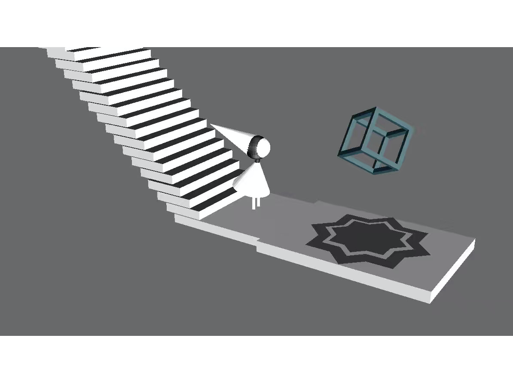

# Edge

This is a course project for 15-112 @ CMU that I took in my freshman fall. It is inspired by the original game _Monument Valley_ and the quote from Galileo:

> Philosophy [i.e. natural philosophy] is written in this grand book — I mean the Universe — which stands continually open to our gaze, but it cannot be understood unless one first learns to comprehend the language and interpret the characters in which it is written. It is written in the language of mathematics, and its characters are triangles, circles, and other geometrical figures, without which it is humanly impossible to understand a single word of it; without these, one is wandering around in a dark labyrinth.
>
> -Galileo Galilei

  <figure class="image">
  	
  	<figcaption>Screenshot generated from running the game</figcaption>
  </figure>

 

I used [Blender](https://www.blender.org) for modeling and [Panda3D](https://www.panda3d.org) for simulating the 3D space. The 2D illusion so far only includes Penrose triangles (because figuring out the right light and shade in modeling is so hard). I also wrote an algorithm in Python for generating random solvable mazes.

Given the 3-week time constraints of the term project, I didn't manage to finish self-learning more advanced features like bones to allow natural movements of the figure. But overall, as my first time of doing an individual large project, I'm satisfied with learning a lot about time management and how to get around with technical issues.

---

- [Github](https://github.com/kapikantzari/edge)
- [Youtube](https://www.youtube.com/watch?v=lmMKk0I1g78)

[back](./..)

