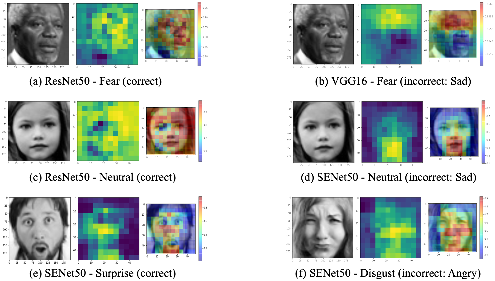

# Emotion Detection with Ensemble-based CNN

This is a course project for 10-701 @ CMU that I took in my junior fall. 

Facial expression is one of the most powerful, natural, and universal signals for human beings to convey their emotional states and intentions. While there have been several state-of-the-art deep learning networks for emotion detection, we aimed to combine new methods in recent research to achieve better results for Facial Expression Recognition Challenge 2013 (FER2013). In this project, we performed transfer learning for fine-tuning pre-trained deep convolutional neural network (CNN) models (ResNet18, ResNet50, SENet50, VGG16). We also developed an ensemble model that achieved a test accuracy of **72.9%**, which shows a large performance gain. For error analysis, we used confusion matrices and occlusion-based saliency maps for further analysis and better interpretability of the results.

  <figure class="image">
  	
  	<figcaption>Occlusion-based saliency map samples</figcaption>
  </figure>

 

Our work is inspired by the [awesome project](https://github.com/amilkh/cs230-fer) by Amil Khanzada *et al.* Many thanks to my super awesome teammates Zhiyi (Amelia) Kuang and Yuxin (Abbey) Pei!

---

- [Final Report](./10701_report.pdf)
- [Github](https://github.com/kapikantzari/10701-final-project)
- [Video](https://drive.google.com/file/d/1FK9Fy23ziX9rP_OrmA6c16VkCf_t0Zga/view?usp=sharing)

[back](./..)

