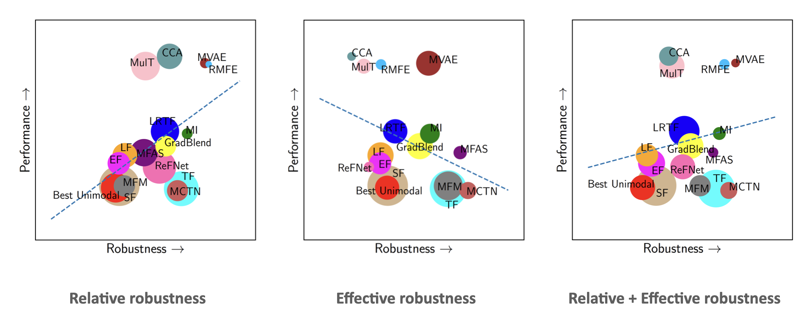

## MultiBench: Robustness

I worked with [Paul Liang](http://www.cs.cmu.edu/~pliang/), identified
modality-specific and multimodal imperfections, developed evaluation metrics for
multimodal robustness and integrate them into a unified large-scale benchmark that
assesses generalization, complexity, and robustness of multimodal models.

  <figure class="image">
  	
  	<figcaption>Robustness plots</figcaption>
  </figure>

We visualize the robustness of common multimodal models using two metrics, relative and effective robustness, as well as a combination of both. These plots indicate the tradeoff between accuracy and robustness.

We have submitted the paper to NeurIPS 2021 Track Datasets and Benchmarks Round1.

---

- [Project page](https://cmu-multicomp-lab.github.io/multibench)
- [GitHub](https://github.com/pliang279/MultiBench)
- [Proposal](./tradeoff2020_proposal.pdf)

[back](./..)

