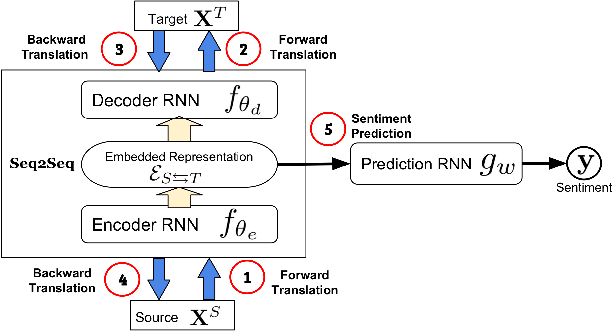
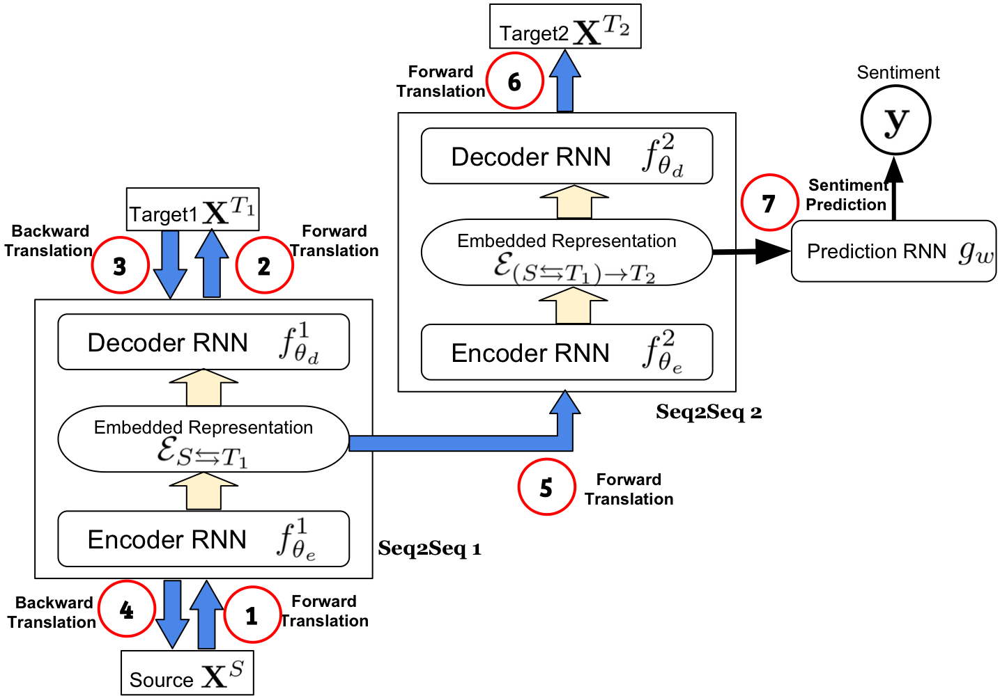

## [Found in Translation: Learning Robust Joint Representations by Cyclic Translations Between Modalities](.https://arxiv.org/abs/1812.07809)

#### Challenge/Opportunity

- For multimodal sentiment analysis, existing works require all modalities to learn a joint representation, which is sensitive to noisy or missing modalities during testing.

#### SOA Knowledge/Solution

- Earlier works include fusion approaches, multistage approach to learn hierarchical representations, attention and memory mechanism, and generative methods.
- To infer missing modalities, an approach is to model the probabilistic inter-modal relationships. This is achieved by sampling from the conditional distributions over each modality.
- Training with modalities dropped at random improves robustness of joint representations.

#### Approach (MCTN)

- **Dataset**: CMU-MOSI, ICT-MMMO, and Youtube with the same speaker not appearing in both training and testing.

- **Feature extraction**: GloVe word embeddings (language), Facet (visual), and COVAREP (acoustic), P2FA (alignment)

- **Multimodal cyclic translations**:

  - **Forward translations** (source $\to$ target): given source modality $S$ and target $T$,

    - Compute joint embedding (Seq2Seq) 
      $$
      \mathcal{E}_{S\to T}=f_{\theta_e}(\textbf{X}^S)
      $$
      

    - Transform into target modality (beam search approach) 
      $$
      \textbf{X}^T=f_{\theta_d}(\mathcal{E}_{S\to T})
      $$
      

    - Loss: 
      $$
      \mathcal{L}_t=\mathbb{E}[\ell_{\textbf{X}^T}(\hat{\textbf{X}}^T,\textbf{X}^T)]
      $$
      

  - **Backward translations** (predicted target $\to$ source):

    - Compute joint embedding 
      $$
      \mathcal{E}_{T \to S}=f_{\theta_e}(\hat{\textbf{X}}^T)
      $$
      

    - Transform into target modality 
      $$
      \hat{\textbf{X}}^S=f_{\theta_d}(\mathcal{E}_{T\to S})
      $$
      

    - Loss: 
      $$
      \mathcal{L}_c=\mathbb{E}[\ell_{\textbf{X}^S}(\hat{\textbf{X}}^S,\textbf{X}^S)]
      $$
      

  - **Prediction**:

    - Loss: 
      $$
      \mathcal{L}_p=\mathbb{E}[\ell_{\textbf{y}}(\hat{\textbf{y}},\textbf{y})]
      $$
      

  - **Coupled translation-prediction objective function**: $\mathcal{L}=\lambda_t\mathcal{L}_t+\lambda_c\mathcal{L}_c+\mathcal{L}_p$

  

- **Hierarchical MCTN** performs two levels of modality translations and doesn't use a cyclic translation loss except the first level of translation since the ground truth embedding is unknown.

  

#### Results

- MCTN chieves new SOA results on the tested datasets.
- <mark>MCTN only uses source modality for prediction and thus ensures robustness to noisy/missing modalities.</mark>
- <mark>Adding more modalities improves learning more discriminative joint representations.</mark>
- <mark>Cyclic translations add regularization while ensuring the representation retain maximal information from all modalities.</mark>
- Language is the most discriminative modality in the joint representation.
- Representation learning is easier when task is broken down recursively.

#### Thoughts

- Other than selecting the most significant features in learning, another aspect of model robustness is to handle imperfect training/testing datasets.